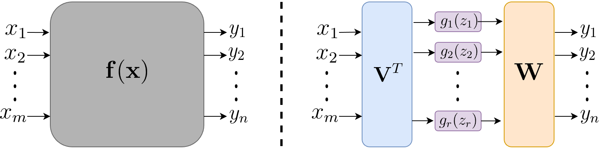

# Untangle

Fast tensor decoupling in Jax. Collection of algorithms for decoupling multivariate functions using tensor decompositions.

This project was built using `uv` (https://docs.astral.sh/uv). 

### Installation

You can easily get `untangle` from PyPI:
```bash
pip install decoupling # ("untangle" was already taken...)
```
Otherwise, for a local `uv` installation:
```bash
git clone git@github.com:mrochk/untangle.git
uv add ./untangle # or pip install ./untangle
```

### Methodology

Tensor decoupling algorithms are used to find a decoupled representation of a target multivariate function. This is illustrated below.

<p align="center">

</p>

In fact, this representation is a 2-layer MLP, meaning that tensor decoupling could be used to compress or build neural networks.

You can read about the basic methodology in this paper: https://arxiv.org/abs/1410.4060.

The goal of this library is to be the reference implementation of tensor decoupling algorithms. Our goal is to keep the source code as simple as possible, while being fast by leveraging Jax's JIT compiler, and, later, GPUs. 

The other important aspect is that it should be easy to design and add new algorithms, by leveraging already written and reusable code.

### Algorithms Implemented

- Polynomial Tensor Decoupling `untangle/algorithm/basic` [Dreesen, Ishteva & Schoukens (2015)]
- Constrained Polynomial TD `untangle/algorithm/ctd_polynomial` [Hollander, (2017)]
- CMTF B-Spline Decoupling `untangle/algorithm/cmtf_bspline` [De Jonghe & Ishteva (2025)]
- CMTF P-Spline Decoupling `untangle/algorithm/cmtf_pspline`

### Testing

```bash
uv run -m unittest discover testing -v # or ./test.sh
```